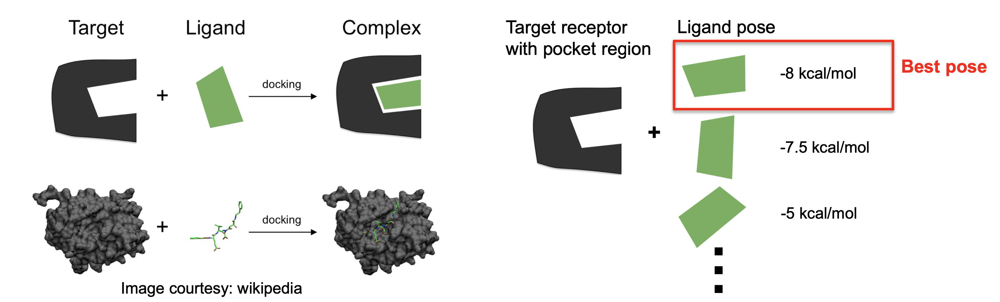

# LLNL--Data-Science-Challenge-2022-
Task to solve an exciting problem in drug discovery for COVID-19

Molecular docking is a method in computational chemistry to find molecule’s pose (orientation) and conformation where the ligand and target receptor are bound to form a stable complex. The best pose is selected based on the scoring functions (binding free energy). Ligands are screened using their best score (lowest binding free energy).

Two different approaches were used for the task:

1. Screen compounds using SMILES and molecular descriptor
2. Screen compounds using 3D atomic representation
